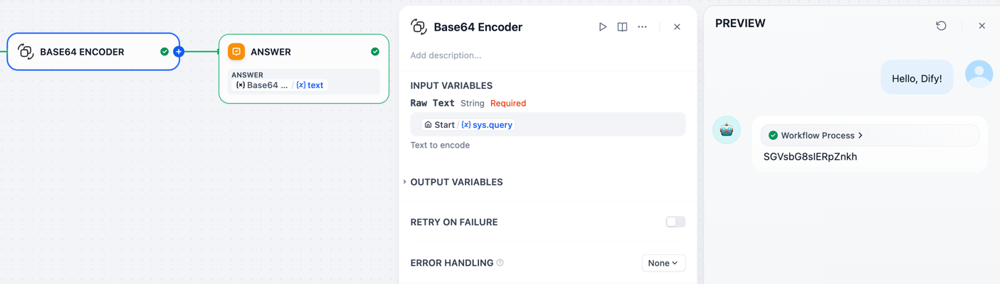
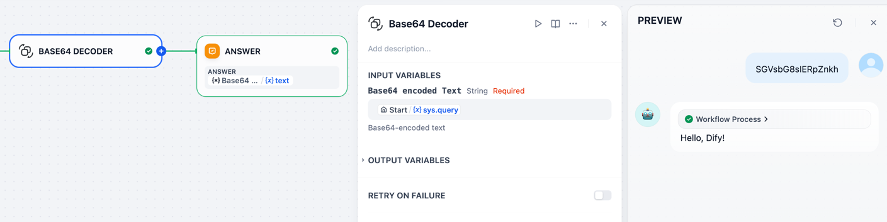
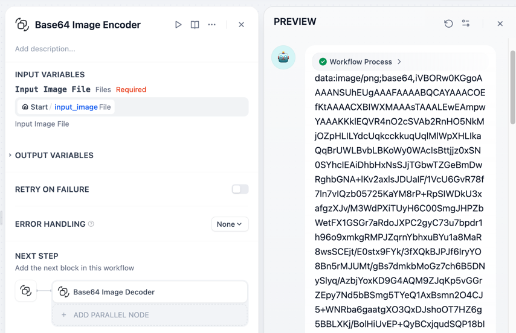

# Base64 Codec - Encode and Decode Base64

**Author:** [bowenliang123](https://github.com/bowenliang123)

**Github Repository:** https://github.com/bowenliang123/base64_codec

**Dify Marketplace:** https://marketplace.dify.ai/plugins/bowenliang123/base64_codec

This Dify plugin provides tools for encoding and decoding Base64 specified in [RFC 4648](https://datatracker.ietf.org/doc/html/rfc4648.html).
It supports text, image files and binary files for the input or output.
URL safe Base64 encoding is also supported for text encoding and decoding.

## Description

| Tool                 | Input                                                    | Output              |
|----------------------|----------------------------------------------------------|---------------------|
| base64_encoder       | Raw text                                                 | Base64 encoded text |
| base64_decoder       | Base64 encoded text                                      | Raw text            |
| base64_image_encoder | Image file                                               | Base64 encoded text |
| base64_image_decoder | Base64 encoded text of PNG, JPG, WEBP, SVG format prefix | Image file          |
| base64_file_encoder  | Binary file                                              | Base64 encoded text |

## Tools and Usage

- Raw text → Base64 Encoded text

  

- Base64 Encoded text → Raw text

  

- Image file → Base64 Encoded text

  

- Base64 Encoded text → Image file

  

- Binary file → Base64 Encoded text

## Changelog

- 0.3.0:
  - Support customize the output file name in `base64_image_decoder` tool

- 0.2.0
    - Add `base64_file_encoder` for encoding binary file to Base64 encoded text

- 0.1.0
    - Add `base64_image_encoder` for encoding image file to Base64 encoded text

- 0.0.3
    - Support URL safe Base64 encoding and decoding

- 0.0.1
    - Initial release for text encoding and decoding and image decoding from Base64 encoded text

## License

- Apache License 2.0

## Privacy

This plugin collects no data.

All the file transformations are completed locally. NO data is transmitted to third-party services.
